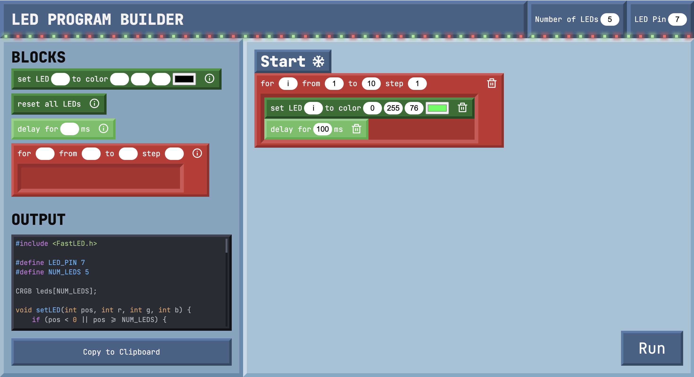
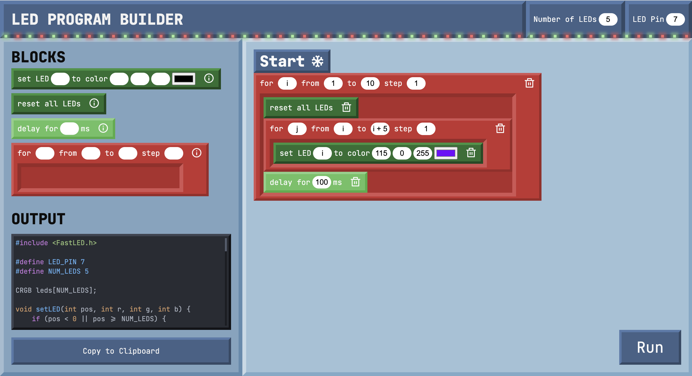

# led-program-builder

A Scratch-like web interface to generate code for an Arduino-controlled addressable LED strip.
The block code can be transpiled into the appropriate C++ code to be uploaded to the Arduino.

## Images

